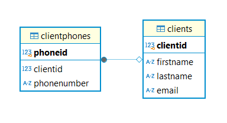

# Домашнее задание к лекции «Работа с PostgreSQL из Python»

### Создана программа для управления клиентами на Python.

Требуется хранить персональную информацию о клиентах:

- имя,
- фамилия,
- email,
- телефон.

Сложность в том, что телефон у клиента может быть не один, а два, три и даже больше. А может и вообще не быть телефона, например, он не захотел его оставлять.

### Разработана структура БД для хранения информации и несколько функций на Python для управления данными.

#### Схема БД:

#### Реализованные функциии:
1. Функция, создающая структуру БД (таблицы) (create_database).
1. Функция, позволяющая добавить нового клиента (add_client).
1. Функция, позволяющая добавить телефон для существующего клиента (add_phonenumber).
1. Функция, позволяющая изменить данные о клиенте (update_client_data).
1. Функция, позволяющая изменить номер телефона у сущестующего клиента (update_phonenumber).
1. Функция, позволяющая удалить телефон для существующего клиента (delete_clientphone).
1. Функция, позволяющая удалить существующего клиента (delete_client).
1. Функция, позволяющая найти клиента по его данным: имени, фамилии, email или телефону (find_client).

Также реализован код, демонстрирующий работу всех написанных функций.